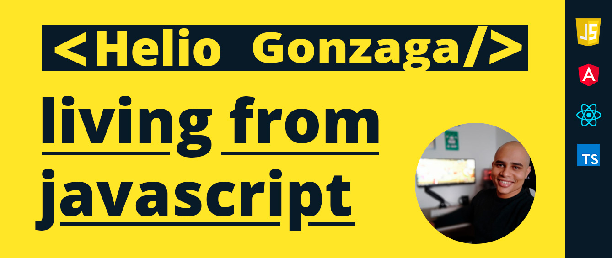

# Helio Gonzaga 👋

  

## Linguagens e Tecnologias que uso diariamente

<code></code>
<code></code>
<code></code>
<code></code>
<code></code>
<code></code>
<code></code>
<code></code>
<code></code>

## Habilidades

**Linguagens**

**Front-end**

**IDE**
 ❤️

**Controle de versão e comunicação**

👋 [Helio Gonzaga](https://github.com/heliogsantos/)
